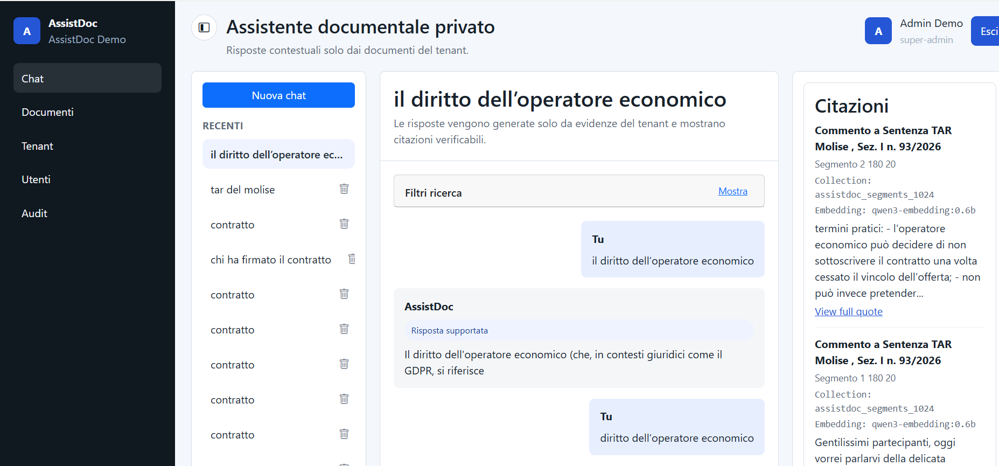
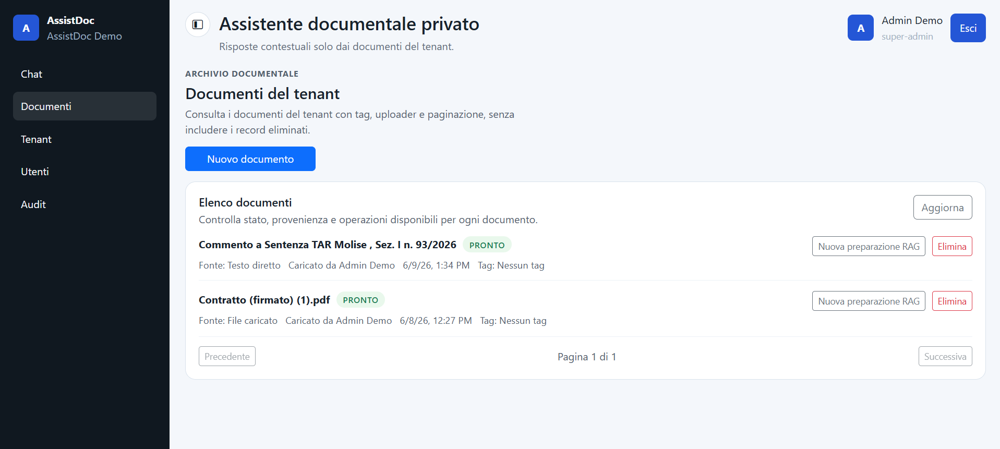

# AssistDoc

## Enterprise Knowledge Assistant based on Generative AI and RAG

AssistDoc è un progetto che realizza un assistente intelligente per l'interrogazione di documentazione aziendale attraverso tecniche di **Retrieval-Augmented Generation (RAG)**.

L'obiettivo è esplorare come **Large Language Models (LLM)**, **ricerca semantica** e sistemi di recupero della conoscenza possano migliorare l'accesso alle informazioni contenute in documenti strutturati e non strutturati.

Il progetto studia un approccio in cui gli utenti possono interagire con la conoscenza organizzativa attraverso il linguaggio naturale, combinando tecniche di ricerca documentale con capacità generative basate su modelli linguistici.

## Scenario applicativo

Nelle organizzazioni complesse una parte significativa della conoscenza è distribuita in numerose fonti documentali:

- regolamenti e normative;
- procedure operative;
- documentazione tecnica;
- manuali;
- documenti amministrativi;
- basi di conoscenza interne.

La difficoltà principale non è solo conservare queste informazioni, ma renderle facilmente accessibili e interrogabili.

AssistDoc esplora un modello in cui l'utente può porre domande in linguaggio naturale e ottenere risposte contestualizzate sulla base delle informazioni contenute nella documentazione disponibile.

## Obiettivi del progetto

AssistDoc nasce per sperimentare:

- l'integrazione di Large Language Models nei sistemi informativi enterprise;
- l'utilizzo di architetture Retrieval-Augmented Generation (RAG);
- nuove modalità di accesso alla conoscenza organizzativa;
- tecniche di ricerca semantica applicate a documenti aziendali;
- architetture software sicure e scalabili per applicazioni basate su AI.

## Documentazione

La documentazione tecnica del progetto è disponibile nella cartella `docs`.

- [Architettura del sistema](docs/architecture.md)
- [Profili RAG](docs/rag-profiles.md)

## Architettura

AssistDoc segue un'architettura applicativa enterprise full-stack. 

Il sistema comprende:

* acquisizione e preparazione documenti;
* indicizzazione semantica;
* recupero dei contenuti rilevanti;
* generazione della risposta tramite LLM;
* interazione conversazionale con la conoscenza aziendale.

## Tecnologie esplorate

* Large Language Models (LLM)
* Retrieval-Augmented Generation (RAG)
* Semantic Search
* Vector Embeddings
* Prompt Engineering

## Possibili applicazioni

* assistenti per documentazione interna;
* supporto alla consultazione di procedure;
* knowledge management aziendale;
* sistemi informativi enterprise.

# Struttura del repository

- `backend/`: Applicazione API Laravel
- `frontend/`: Single Page Application Angular
- `infra/`: Configurazione infrastruttura e deployment
- `specs/`: Specifiche funzionali, piani e documentazione progettuale

## Stato del progetto

- struttura monorepository;
- separazione backend/frontend;
- base applicativa Laravel;
- autenticazione applicativa;
- gestione del contesto tenant;
- fondazione API;
- struttura iniziale per interazione conversazionale.

## API di autenticazione

- `POST /api/v1/auth/login` Autentica un utente locale e restituisce un token con contesto tenant associato
- `GET /api/v1/auth/me` Ripristina il contesto autenticato utilizzato dall'applicazione frontend
- `POST /api/v1/auth/logout` Invalida il token corrente

## Interfaccia

### Assistente documentale

### Gestione documenti 

## Roadmap

### Completato

- [x] Architettura multi-tenant
- [x] Autenticazione e autorizzazione
- [x] Gestione del contesto tenant
- [x] Integrazione con Ollama
- [x] Configurazione di profili RAG multipli
- [x] Pipeline di ingestione e indicizzazione dei documenti
- [x] Workflow di Retrieval-Augmented Generation (RAG)
- [x] Ricerca semantica tramite database vettoriale

### In sviluppo

- [ ] Strategie di indicizzazione dipendenti dalla tipologia di documento
- [ ] Streaming delle risposte generate dal modello
- [ ] Supporto a documenti multimediali (immagini, PDF con contenuti grafici, ecc.)
- [ ] Miglioramento della qualità del recupero del contesto (retrieval)
- [ ] Dashboard di monitoraggio e audit
