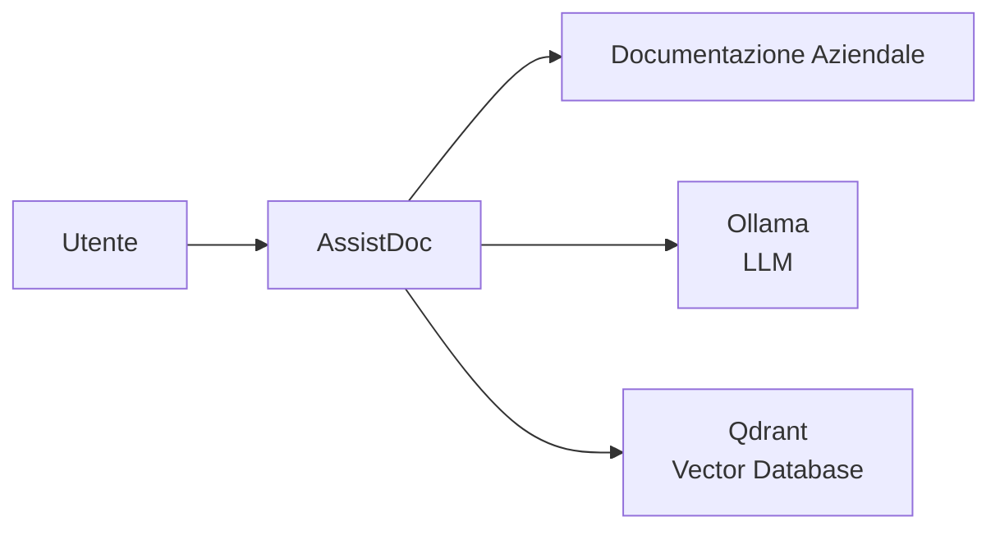
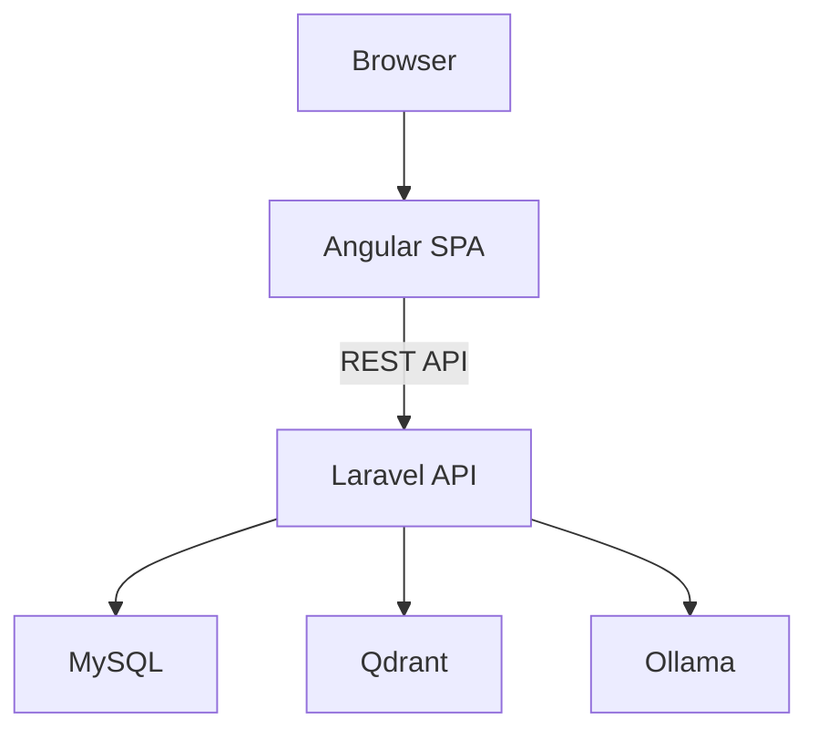
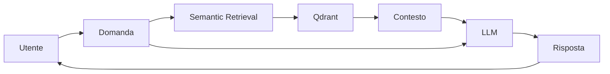
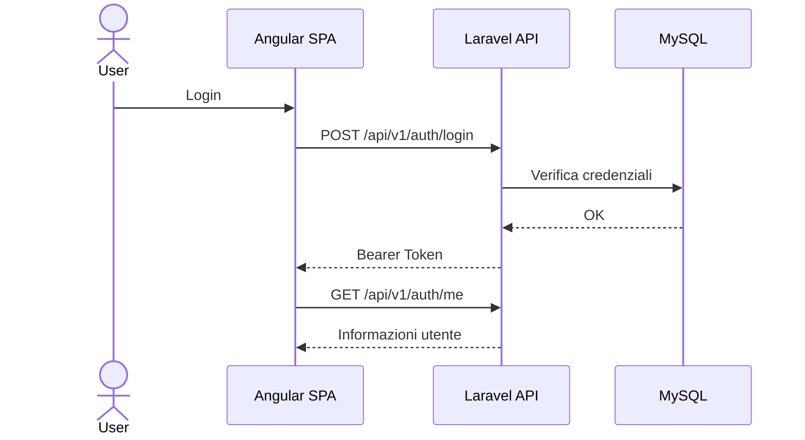

# Architettura di AssistDoc

## Introduzione

AssistDoc è un'applicazione enterprise progettata per esplorare l'integrazione di **Large Language Models (LLM)** e tecniche di **Retrieval-Augmented Generation (RAG)** nella consultazione della documentazione aziendale.

L'architettura è basata su una separazione tra frontend, backend, servizi di Intelligenza Artificiale e componenti dedicati alla ricerca semantica, con particolare attenzione a sicurezza, multi-tenancy e scalabilità.

---

# Obiettivi architetturali

L'architettura è progettata per soddisfare i seguenti obiettivi:

- separazione delle responsabilità tra frontend e backend;
- isolamento dei tenant;
- autenticazione centralizzata;
- integrazione modulare con modelli LLM;
- supporto alla ricerca semantica;
- estendibilità verso nuovi modelli AI;
- semplicità di deployment tramite Docker Compose.

---

# Contesto del sistema

L'utente interagisce esclusivamente con AssistDoc, che coordina l'accesso ai documenti aziendali, al database vettoriale e ai modelli linguistici.

---

# Architettura applicativa

## Frontend

L'interfaccia utente è sviluppata con **Angular** e comunica esclusivamente tramite API REST.

Responsabilità principali:

- autenticazione;
- gestione della sessione;
- caricamento documenti;
- consultazione della documentazione;
- interazione con l'assistente AI.

---

## Backend

Il backend è sviluppato con **Laravel** e rappresenta il punto centrale dell'applicazione.

Responsabilità:

- autenticazione;
- autorizzazione;
- gestione utenti;
- gestione tenant;
- orchestrazione del workflow RAG;
- gestione documentale;
- integrazione con servizi esterni.

---

## Database

MySQL viene utilizzato per memorizzare:

- utenti;
- tenant;
- documenti;
- configurazioni;
- audit;
- cronologia delle conversazioni.

---

## Qdrant

Qdrant è utilizzato come **Vector Database**.

Responsabilità:

- memorizzazione degli embedding;
- ricerca semantica;
- recupero dei documenti rilevanti.

---

## Ollama

Ollama fornisce i modelli linguistici utilizzati dall'applicazione.

Attualmente il progetto supporta differenti profili RAG configurabili in funzione delle risorse hardware disponibili.

---

# Workflow RAG

Il flusso segue questi passaggi:

1. l'utente inserisce una domanda;
2. il backend ricerca i documenti semanticamente più rilevanti;
3. i documenti recuperati vengono utilizzati come contesto;
4. il modello LLM genera la risposta;
5. la risposta viene restituita all'utente.

---

# Autenticazione

Il contesto del tenant viene determinato lato server e non può essere modificato dal client.

---

# Componenti principali

| Componente | Responsabilità |
|------------|----------------|
| Angular SPA | Interfaccia utente |
| Laravel API | Logica applicativa |
| MySQL | Dati applicativi |
| Qdrant | Ricerca vettoriale |
| Ollama | Inferenza LLM |

---

# Principi architetturali

AssistDoc adotta i seguenti principi:

- API First;
- separazione delle responsabilità;
- progettazione modulare;
- sicurezza by design;
- isolamento dei tenant;
- integrazione AI indipendente dal provider;
- configurazione tramite variabili d'ambiente.

---

# Evoluzioni previste

Le prossime evoluzioni dell'architettura includono:

- pipeline completa di ingestione documentale;
- supporto a differenti strategie di chunking;
- gestione di modelli LLM multipli;
- reranking dei risultati;
- streaming delle risposte;
- osservabilità e metriche;
- caching intelligente;
- supporto a modelli multimodali.

---

# Tecnologie

- Laravel
- Angular
- MySQL
- Qdrant
- Ollama
- Docker Compose
- Large Language Models (LLM)
- Retrieval-Augmented Generation (RAG)
- Semantic Search